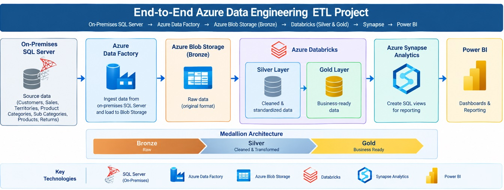
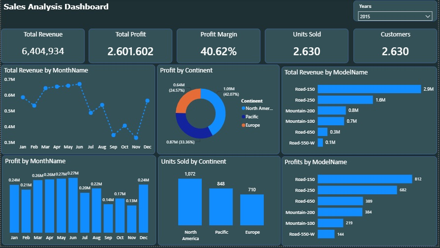

# 🚀 End-to-End Azure Data Engineering ETL Project

### 📌 Project Overview
This project demonstrates the design and implementation of an **end-to-end cloud data engineering pipeline on Microsoft Azure**, transforming raw data from an on-premises SQL Server environment into business-ready analytical data for reporting and visualization.

The project follows a **modern Medallion Architecture**, consisting of **Bronze, Silver, and Gold data layers.** Azure Data Factory is used for data ingestion, Azure Blob Storage serves as the cloud data lake, Azure Databricks performs data transformation and processing, Azure Synapse Analytics provides the analytical serving layer, and Power BI is used for business intelligence and reporting.

The solution demonstrates how an organization can move from traditional on-premises data storage to a scalable cloud-based data platform while maintaining a structured and efficient data processing workflow.

### 🏗️ Architecture

### 🛠️ Architecture Components
| Components	| Technology | Purpose |
|---------|---------|---------|
| Source System | On-Premises SQL Server | Stores raw operational data |
| Data Ingestion	| Azure Data Factory | Extracts data from SQL Server and loads it into Azure |
| Data Lake	|Azure Blob Storage | Stores Bronze, Silver and Gold datasets |
| Data Processing |	Azure Databricks | Cleans, transforms and prepares data |
| Analytical Layer	| Azure Synapse Analytics | Provides SQL-based access to curated Gold data |
| Visualization |	Power BI | Creates dashboards and business reports |

### 🎯 Project Objectives
The main objectives of this project were to:
- Build an end-to-end Azure data engineering pipeline.
- Integrate an on-premises SQL Server data source with Azure.
- Implement automated cloud data ingestion using Azure Data Factory.
- Build a structured data lake using Azure Blob Storage.
- Implement Bronze, Silver and Gold data layers.
- Perform scalable data transformation using Azure Databricks.
- Create business-ready analytical datasets.
- Expose curated data through Azure Synapse Analytics.
- Create SQL views for reporting consumption.
- Build interactive dashboards using Power BI.

### 🥉 Bronze Layer — Raw Data
The first stage of the pipeline is the Bronze Layer. Azure Data Factory extracts the datasets from the on-premises SQL Server environment and loads them into Azure Blob Storage. The Bronze layer represents the raw landing zone of the data. The layer:
- Ingest data from the source system
- Preserve the original source data
- Store data in the cloud
- Provide a historical/raw copy of the source
- Separate ingestion from downstream transformation

### 🥈 Silver Layer — Cleaned and Transformed Data
After the raw datasets are loaded into the Bronze layer, Azure Databricks is used to process and transform the data. The transformed datasets are stored in the Silver Layer in Azure Blob Storage. The Silver layer contains data that has been cleaned, standardized and prepared for further analytical processing. The Databricks transformation process includes:
- Data cleansing
- Data type standardization
- Column renaming
- Filtering invalid records
- Standardizing formats
- Creating derived columns

### 🥇 Gold Layer — Business-Ready Data
The Gold layer represents the final curated data layer. After the Silver datasets have been cleaned and transformed, Azure Databricks applies the required business logic to create analytics-ready datasets. The Gold layer is optimized for downstream analytical consumption.

### 📈 Power BI Reporting
The final layer of the architecture is Microsoft Power BI. Power BI connects to the analytical views exposed through Azure Synapse Analytics. The curated data is then used to build interactive dashboards and reports. The dashboard is shown below:

### 👨‍💻 Skills Demonstrated
Through this project, I demonstrated my ability to design and implement an end-to-end data engineering solution using Microsoft Azure.

The project covers the complete data lifecycle, from **on-premises data extraction through cloud ingestion, data lake storage, distributed transformation, analytical serving and business intelligence reporting.**

#### Core Skills

Azure Data Engineering | ETL | Data Lakes | Azure Data Factory | Azure Blob Storage | Azure Databricks | PySpark | SQL | Azure Synapse Analytics | Power BI | Data Transformation | Data Modeling | Medallion Architecture | Business Intelligence

### ⭐ Conclusion

This project represents a practical implementation of a modern Azure data engineering architecture.

By combining **Azure Data Factory for ingestion, Azure Blob Storage for data lake storage, Azure Databricks for transformation, Azure Synapse Analytics for analytical serving, and Power BI for visualization,** the solution demonstrates how data can be transformed from raw operational information into actionable business insights.

The architecture is designed around scalability, maintainability, separation of responsibilities and efficient analytical consumption.

